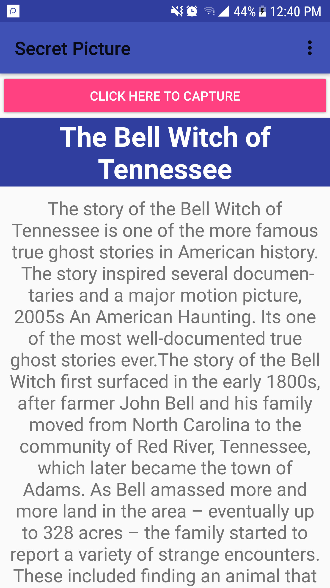
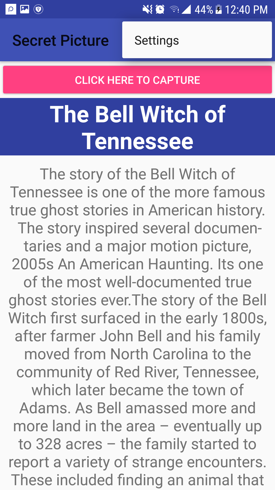
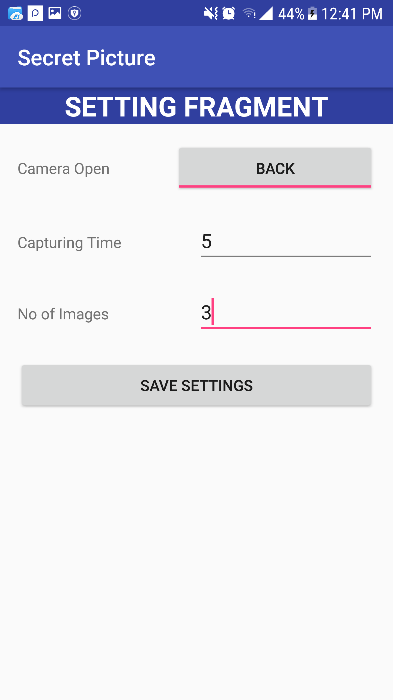
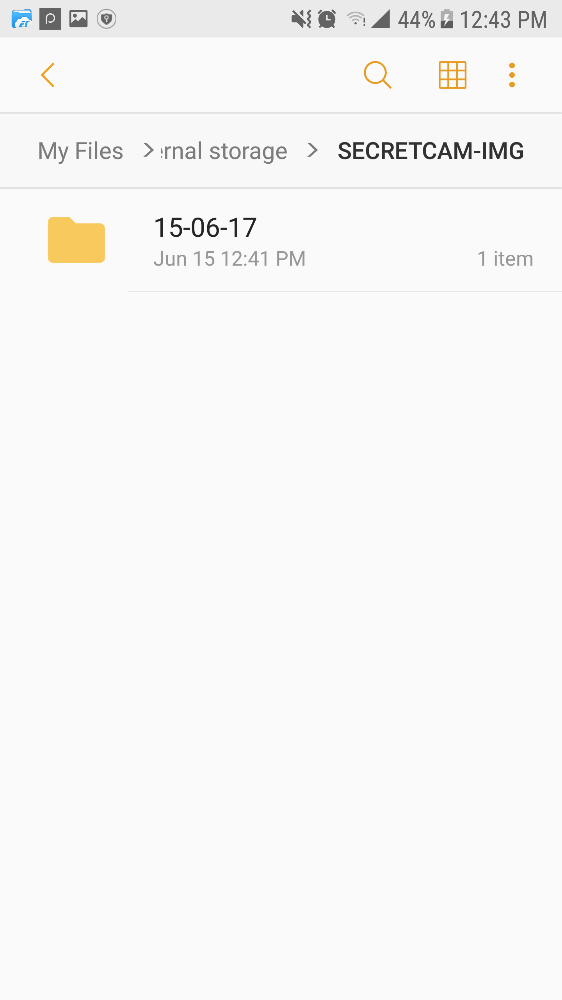

# Android Secret Picture Taker
Android Secret Picture Taker using CAMERA2 API
## Preview

## Contributors

Android Secret Picture Taker is the extended version of Repository "android-camera2-secret-picture-taker" made by Hamed ZITOUN <zitoun.hamed@gmail.com>
 New Contributer: Ali Azaz Alam <ali.azaz.alam@hotmail.com>

## Working

Take the pictures without knowing the others ones, The other one will consider that you'r reading an article but you were taking the photos. Take the pictures by click on button "CLICK HERE TO CAPTURE" or press two times Volume Down button. User can also select by which camera he want's to take the pictures FRONT or BACK, also specify the caputuring time and no of pictures he want's to taken in that time frame from setting activity. All taken images will save in the FILE MANAGER with the name of folder "SECRETCAM-IMG". Inside the folder pictures distributed in the folders, based on dates.

Download apk directly through link: <https://github.com/AliAzaz/AndroidSecretImageTaker/blob/master/apk/secret-pic-taker-15.6.17.apk>

## Help

If you run into issues, please don't hesitate to find help on the GitHub project.

## License

I'm also copying the same license as stated by Hamed ZITOUN

The Android Secret Picture Taker is covered by the MIT License.

The MIT License (MIT)

Copyright (c) 2017 Ali Azaz Alam and contributors to the Android Secret Picture Taker project.

Permission is hereby granted, free of charge, to any person obtaining a copy of this software and associated documentation files (the "Software"), to deal in the Software without restriction, including without limitation the rights to use, copy, modify, merge, publish, distribute, sublicense, and/or sell copies of the Software, and to permit persons to whom the Software is furnished to do so, subject to the following conditions:

The above copyright notice and this permission notice shall be included in all copies or substantial portions of the Software.

THE SOFTWARE IS PROVIDED "AS IS", WITHOUT WARRANTY OF ANY KIND, EXPRESS OR IMPLIED, INCLUDING BUT NOT LIMITED TO THE WARRANTIES OF MERCHANTABILITY, FITNESS FOR A PARTICULAR PURPOSE AND NONINFRINGEMENT. IN NO EVENT SHALL THE AUTHORS OR COPYRIGHT HOLDERS BE LIABLE FOR ANY CLAIM, DAMAGES OR OTHER LIABILITY, WHETHER IN AN ACTION OF CONTRACT, TORT OR OTHERWISE, ARISING FROM, OUT OF OR IN CONNECTION WITH THE SOFTWARE OR THE USE OR OTHER DEALINGS IN THE SOFTWARE.

